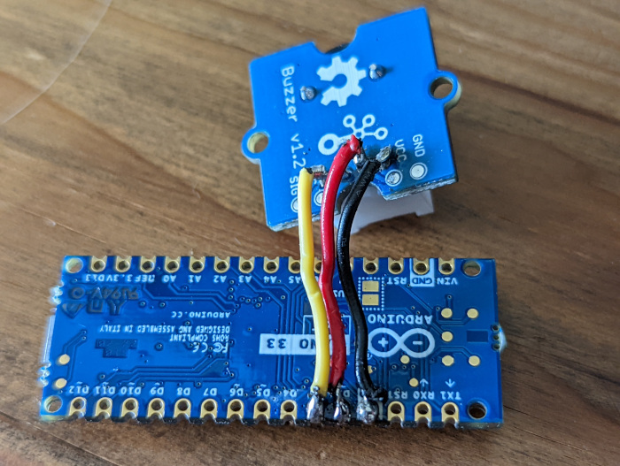

# Automatic Cat Scolder

This is a microcontroller project designed to keep cats from doing things they're not supposed to - like eating houseplants (I'm looking at *you*, Tom!). It does this by making an alarming noise when the cat gets too close.

## How it works

This project is designed to run on an [Arduino Nano 33 IOT](https://store-usa.arduino.cc/products/arduino-nano-33-iot) (though it could be configured to run on a different microcontroller with BLE capabilities). The program intermittently searches for a BLE tag worn on the cat's collar and uses its signal strength (the [RSSI](https://en.wikipedia.org/wiki/Received_signal_strength_indication)) to guage the cat's distance from the microcontroller. If the signal is strong enough, it sounds the alarm.

Note: The current alarm sound apparently isn't scary enough to deter my cat, so I'm still working on that part.

## Parts and assembly



I used an [Arduino Nano 33 IOT](https://store-usa.arduino.cc/products/arduino-nano-33-iot) and a [Grove Piezo Buzzer](https://www.seeedstudio.com/Grove-Buzzer.html), though different (but functionally equivalent) parts could potentially be used instead. The following connections need to be made between the microcontroller and the buzzer:

- The buzzer's "GND" pin needs to be connected to a ground pin on the microcontroller.
- The buzzer's "VCC" pin needs to be connected to a digital pin on the microcontroller. This is for powering the buzzer.
- Thu buzzer's "SIG" pin needs to be connected to a digital pin on the microcontroller. This is for sending the square wave signal to the buzzer to produce sounds.

## How to run the project

This project is built using the [PlatformIO](https://platformio.org/) framework. To run the project, you'll first need to install either the [PlatformIO CLI](https://docs.platformio.org/en/latest/core/installation/index.html) or a [PlatformIO IDE extension](https://docs.platformio.org/en/latest/integration/ide/pioide.html). Once PlatformIO is set up and your microcontroller is plugged in, you can upload and run the project using the [CLI run command](https://docs.platformio.org/en/latest/core/userguide/cmd_run.html), or by doing so through your IDE.

### Configuration

To configure the project, there are some constants that need to be set:

- `TARGET_PERIPHERAL_NAME`: The "local name" attribute of the target device (i.e., the BLE tag on the cat's collar).
- `LED_PIN`: The microcontroller's LED pin number. This is used to turn the LED on and off for debugging purposes.
- `BUZZER_POWER_PIN`: The microcontroller's pin number that is connected to the buzzer's "VCC" pin.
- `BUZZER_SIGNAL_PIN`: The microcontroller's pin number that is connected to the buzzer's "SIG" pin.

To set these constants, create a file called `constants.h` at the root of the project, and then set the constants using the `#define` directive. Here is an example:

```c++
#define TARGET_PERIPHERAL_NAME "CAT-TAG"
#define LED_PIN LED_BUILTIN
#define BUZZER_POWER_PIN 2u
#define BUZZER_SIGNAL_PIN 3u
```

### Debugging

This project uses the microcontroller's LED to give debugging information. It is used in the following situations:

- Each time the target peripheral is detected but is too far away to trigger the alarm, the LED will give two brief flashes in a row.
- If the program restarts (this happens if it can't find the target peripheral 5 times in a row), it will turn the LED on while it's restarting.

In addition, the project writes string-based log messages, which can be read from the microcontroller's serial port using a baud rate of 9600 bits per second.